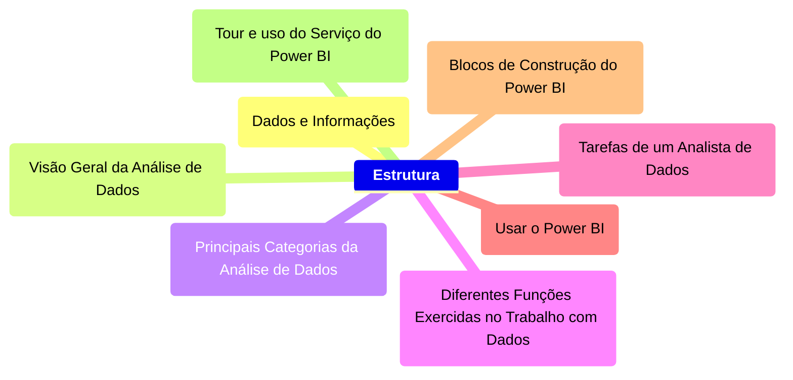

  

    <h2>Fundação Bradesco: Fundamentos do Power BI</h2>
  

  

    

      <h3>Introdução à Análise de Dados</h3>
    

    

 

  ### Data and Information

  
Em um mundo cada vez mais competitivo e digitalizado, a organização dos dados e informações é uma ação imprescíndivel no mundo das pessoas e das corporações. Com esses dados, é possível entender tendências de comportamento do passado, do presente e do futuro, de modo que torna possível a interpretação do mundo ao redor abarrotado de incertezas e complexidades: é o fim da vida pacata, do mundo simples e previsível, do mundo estático e seguro!. Portanto, saber absover esse conteúdo e importá-lo para o mundo dos bits e superar limitações biológicas e motoras.

  
Como nada não é tão simples quanto parece, é necessário também ir além. Não basta apenas angariar dados e informações, pois, conhecimento sem ação é apenas lentidão dos dados em vão, não resolve dificuldade, pois o pensar somente é uma nulidade. Por fim, é necessário compreender e agir por sobre o mundo: não basta passivo ser, é necessário muito se mover.

  #### Questions

  ##### 1. Como as empresas podem garantir que os dados coletados sejam precisos e relevantes para suas estratégias de negócios?
  ##### 2. Quais são os principais desafios enfrentados pelos analistas de dados ao tentar transformar dados em narrativas significativas?
  ##### 3. De que maneira a cultura organizacional pode impactar a utilização dos dados nas decisões empresariais?
  ##### 4. Como a tecnologia pode facilitar a identificação de padrões e tendências nos dados coletados?
  ##### 5. O que pode ser feito para melhorar a colaboração entre analistas de dados e outros departamentos dentro da empresa?
  ##### 6. Como as mudanças nas regulamentações sobre privacidade de dados podem afetar as estratégias de coleta e análise de dados nas empresas?
  ##### 7. Quais métricas são mais importantes para avaliar o sucesso das campanhas de marketing baseadas em dados?
  ##### 8. De que forma as empresas podem utilizar os dados para criar uma experiência mais personalizada para seus clientes?

  #### Answers

  ##### 1. Através de uma narrativa precisa de dados, ou seja, que os dados sejam organizados e exibidos de maneira interpretável
  ##### 2. Os principais desafios são: é compreender e utilizar os dados obtidos de modo que eles possam ajudar a tomar decisões eficientes e precisas
  ##### 3. Se não houver uma cultura organizacional que esteja disposta e preparada para utilizar dados analíticos como base para decisões e abdicar dos instintos e experiências prévias, haverá conflitos constantes entres os dados gerados e as pessoas que discordam dos dados.
  ##### 4. Ela facilita através da digitalização dos processos e organizações dos dados com a capacidade de processamento infinitamente maior do que qualquer pessoa.
  ##### 5. Através de um plano de ação que una os dois lados, de modo que eles possam desde o começo estar em uníssono para resolver os problemas utilizando as memsmas ferramentas de análise e as mesmas fontes de dados.
  ##### 6. Elas afetam no sentido de que uma análise de dados de um perfil pode se tornar menos personalizado e único, tornando ações e produtos mais genéricos e imprecisos.
  ##### 7. Proporção entre a campanha feita e pessoas que se engajaram financeiramente, aumento da consciência da marca e de seu "valor ideal agregado" junto ao público, uma boa reputação perante ao público-alvo e o dimensionamento do boca-a-boca, ou seja, o quão grande foi o burburinho gerado pela campanha.
  ##### 8. Recomendação de compras e de combos de serviços ou produtos que estão interligados e que se adequam ao uso do cliente, otimização de preços de forma a aumentar ou diminiur a margem conforme o cliente valoriza ou não tal produto/serviço.

 

### Data Analysis

Para que as decições baseadas em dados tenha o efeito desejado é necessário também uma cultural organizacional que esteja disposta a absorver esse novo moodo de agir e pensar. Não basta apenas forçar o comportamente em dezenas e centenas de pessoas, é preciso de convencê-las de fato da necessidade para a organização e a facilidade que esse novo modo de fazer as coisas irá trazer. Porém, haverá com certeza dores de crescimento para que essas ideias possas se solidificar.

#### Questions

  ##### 1. Como as empresas podem garantir que suas narrativas de dados sejam facilmente acessíveis e compreensíveis para todos os colaboradores?
  ##### 2. De que forma a integração das narrativas de dados nas interações regulares pode impactar a cultura da empresa?
  ##### 3. Quais estratégias podem ser utilizadas para identificar o público-alvo ideal para cada narrativa de dados?

#### Answers

  ##### 1. É preciso de convencê-las de fato da necessidade para a organização e a facilidade que esse novo modo de fazer as coisas irá trazer. Porém, haverá com certeza dores de crescimento para que essas ideias possas se solidificar na mente das pessoas: sempre busque previamente esclarecer as vantagens e os percalços que acontecerão.

  ##### 2. Pode impactar em criar incertezas para os colaboradoes internos e outras pessoas externas, pois mudanças sempre serão mal vistas por muitos, mesmo que seja para melhor. Portanto, a liderança precisa ter certeza e precisão ao decidir implantar uma nova forma de organizar e fazer.
  
  ##### 3. Identificação de colaboradores comprometidos através da identificação do desempenho passado e avaliação de suas contribuições para as mudanças propostas para o futuro. Ou seja, o quão engajado ele está ou não nesse processo.

  

