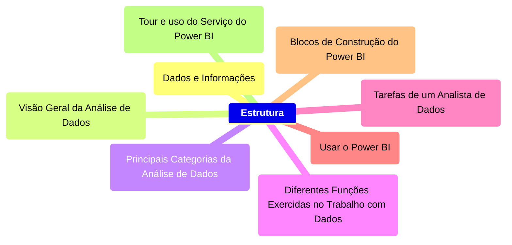

  

    <h2>Fundação Bradesco: Fundamentos do Power BI</h2>

  

  

    

      <h3>Introdução à Análise de Dados</h3>
    

    

```mermaid
mindmap
  **Estrutura**
    (Dados e Informações)
    (Visão Geral da Análise de Dados)
    (Principais Categorias da Análise de Dados)
    (Diferentes Funções Exercidas no Trabalho com Dados)
    (Tarefas de um Analista de Dados)
    (Usar o Power BI)
    (Blocos de Construção do Power BI)
    (Tour e uso do Serviço do Power BI)

```
  
  

  

