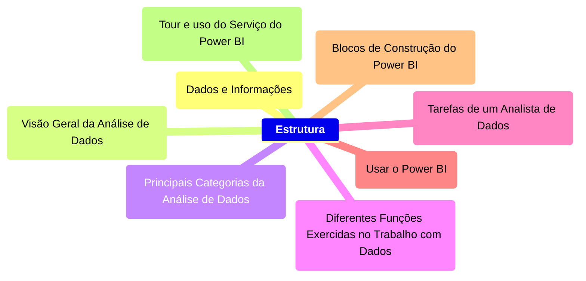

  

    <h2>Fundação Bradesco: Fundamentos do Power BI</h2>

  

  

    

      <h3>Introdução à Análise de Dados</h3>
    

    

  ### Dados e Informações

  
Em um mundo cada vez mais competitivo e digitalizado, a organização dos dados e informações é uma ação imprescíndivel no mundo das pessoas e das corporações. Com esses dados, é possível entender tendências de comportamento do passado, do presente e do futuro, de modo que torna possível a interpretação do mundo ao redor abarrotado de incertezas e complexidades: é o fim da vida pacata, do mundo simples e previsívels, do mundo estático e seguro!. Portanto, saber absover esse conteúdo e importá-lo para o mundo dos bits e superar limitações biológicas e motoras.

  
    
  
  

  

