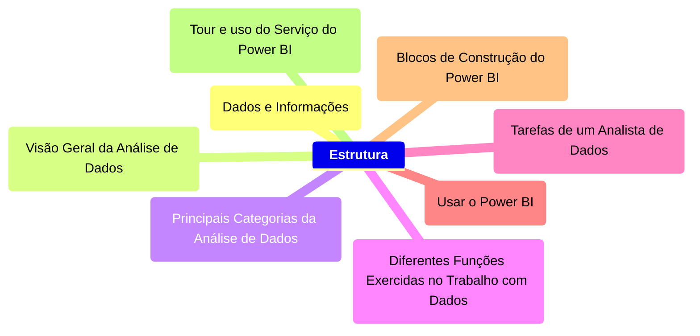

  

    <h2>Fundação Bradesco: Fundamentos do Power BI</h2>
  

  

    

      <h3>Introdução à Análise de Dados</h3>
    

    

  ### Data and Information

  
Em um mundo cada vez mais competitivo e digitalizado, a organização dos dados e informações é uma ação imprescíndivel no mundo das pessoas e das corporações. Com esses dados, é possível entender tendências de comportamento do passado, do presente e do futuro, de modo que torna possível a interpretação do mundo ao redor abarrotado de incertezas e complexidades: é o fim da vida pacata, do mundo simples e previsível, do mundo estático e seguro!. Portanto, saber absover esse conteúdo e importá-lo para o mundo dos bits e superar limitações biológicas e motoras.

  
Como nada não é tão simples quanto parece, é necessário também ir além. Não basta apenas angariar dados e informações, pois, conhecimento sem ação é apenas lentidão dos dados em vão, não resolve dificuldade, pois o pensar somente é uma nulidade. Por fim, é necessário compreender e agir por sobre o mundo: não basta passivo ser, é necessário muito se mover.

  #### Questions

  ##### 1. Como as empresas podem garantir que os dados coletados sejam precisos e relevantes para suas estratégias de negócios?
  ##### 2. Quais são os principais desafios enfrentados pelos analistas de dados ao tentar transformar dados em narrativas significativas?
  ##### 3. De que maneira a cultura organizacional pode impactar a utilização dos dados nas decisões empresariais?
  ##### 4. Como a tecnologia pode facilitar a identificação de padrões e tendências nos dados coletados?
  ##### 5. O que pode ser feito para melhorar a colaboração entre analistas de dados e outros departamentos dentro da empresa?
  ##### 6. Como as mudanças nas regulamentações sobre privacidade de dados podem afetar as estratégias de coleta e análise de dados nas empresas?
  ##### 7. Quais métricas são mais importantes para avaliar o sucesso das campanhas de marketing baseadas em dados?
  ##### 8. De que forma as empresas podem utilizar os dados para criar uma experiência mais personalizada para seus clientes?

  #### Answers

  ##### 1. Através de uma narrativa precisa de dados, ou seja, que os dados sejam organizados e exibidos de maneira interpretável
  ##### 2. Os principais desafios são: é compreender e utilizar os dados obtidos de modo que eles possam ajudar a tomar decisões eficientes e precisas
  ##### 3. Se não houver uma cultura organizacional que esteja disposta e preparada para utilizar dados analíticos como base para decisões e abdicar dos instintos e experiências prévias, haverá conflitos constantes entres os dados gerados e as pessoas que discordam dos dados.
  ##### 4. 

  

