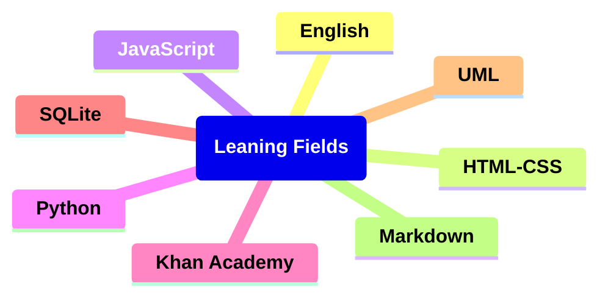

# Learning Diagram:

## Links

### English

<h5><a href ="https://games4esl.com/">games4esl.com</a></h5>

<h5><a href ="https://www.englishclub.com/">englishclub.com</a></h5>

<h5><a href ="https://www.grammarwiz.com/">grammarwiz.com</a></h5>

<h5><a href ="https://test-english.com/">test-english.com</a></h5>

<h5><a href ="https://www.perfect-english-grammar.com/">perfect-english-grammar.com</a></h5>

### Math

<h5><a href ="https://en.khanacademy.org/login">khanacademy</a></h5>

### HTML-CSS

<h5><a href ="https://learnhtmlcss.online/">learnhtmlcss</a></h5>

<h5><a href ="https://v2.scrimba.com/">scrimba.com</a></h5>

<h5><a href ="https://www.w3schools.com/">w3schools.com</a></h5>

### SQLite

<h5><a href ="https://www.sqlitetutorial.net/">sqlitetutorial.net</a></h5>

<h5><a href ="https://www.codecademy.com/">codecademy.com</a></h5>

### JavaScript

<h5><a href ="https://learnjavascript.online/">learnjavascript</a></h5>

<h5><a href ="https://v2.scrimba.com/">scrimba.com</a></h5>

### Python

<h5><a href ="https://realpython.com/">realpython.com</a></h5>

### UML

<h5><a href ="https://plantuml.com/">plantuml.com</a></h5>

<h5><a href ="https://mermaid.js.org/">mermaid.js.org</a></h5>

### Markdown

<h5><a href ="https://www.markdowntutorial.com/">markdowntutorial.com</a></h5>

<h5><a href ="https://www.markdownguide.org/">markdownguide.org</a></h5>

<h5><a href ="https://www.w3schools.io/file/markdown-introduction/">w3schools.io</a></h5>

