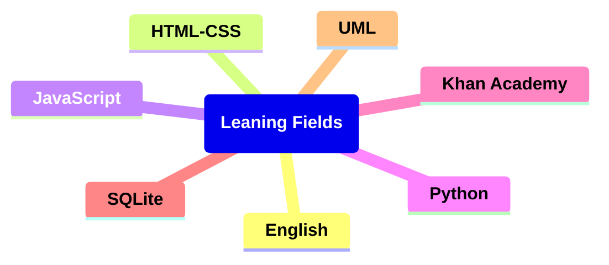

# Learning Diagram:

## Links

### English

https://games4esl.com/

https://www.englishclub.com/

https://test-english.com/

https://www.perfect-english-grammar.com/

### Math

https://en.khanacademy.org/login

### HTML-CSS

https://learnhtmlcss.online/

https://v2.scrimba.com/

### SQLite

https://www.sqlitetutorial.net/

### JavaScript

https://learnjavascript.online/
https://v2.scrimba.com/

### Python

https://realpython.com/
