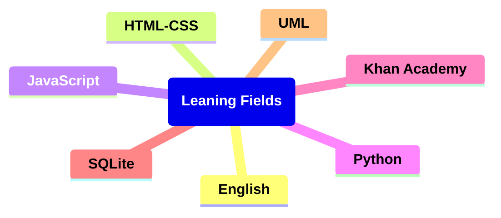

# Learning Diagram:

## Links

### English

<h5><a href ="https://games4esl.com/">games4esl.com</a></h5>

<h5><a href ="https://www.englishclub.com/">englishclub.com</a></h5>

<h5><a href ="https://www.grammarwiz.com/">grammarwiz.com</a></h5>

<h5><a href ="https://test-english.com/">test-english.com</a></h5>

https://www.perfect-english-grammar.com/

### Math

https://en.khanacademy.org/login

### HTML-CSS

https://learnhtmlcss.online/

https://v2.scrimba.com/

### SQLite

https://www.sqlitetutorial.net/

### JavaScript

https://learnjavascript.online/
https://v2.scrimba.com/

### Python

https://realpython.com/
