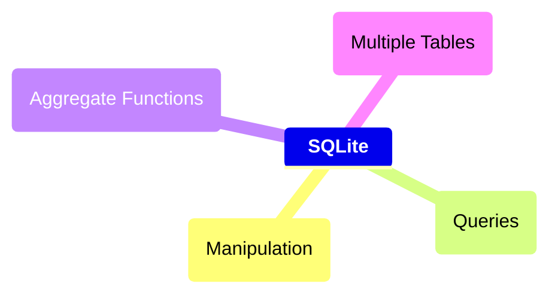
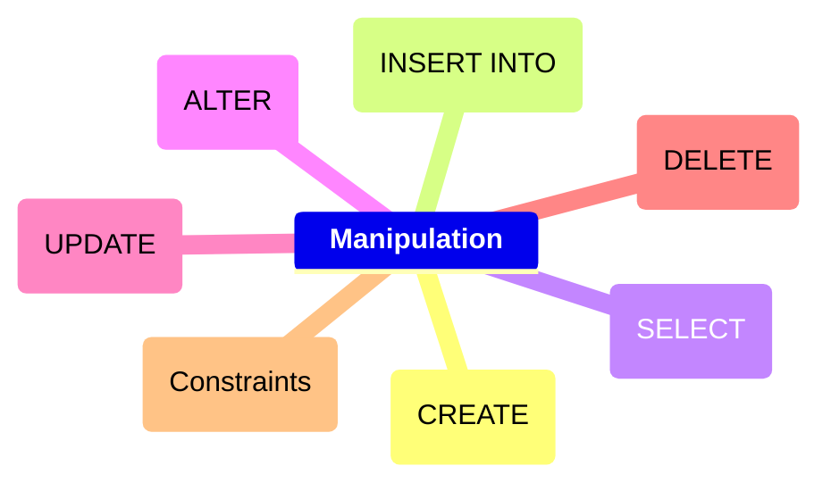
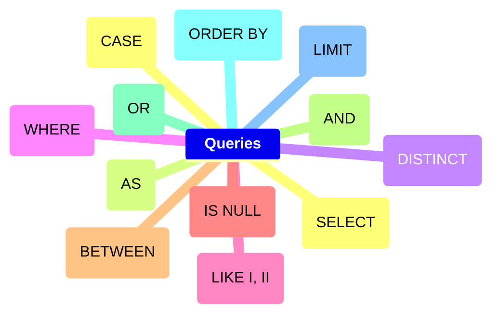

## Course's Mind map



<details>
	<summary><h2>Intro</h2></summary>
	
### What is SQLite

##### SQLite é um moto de banco de dados. Ele permite usuários interagir com um banco de dados relacional. Em SQLite, o banco de dados é armazenado em um único arquivo. Esse fato permite uma grande acessibilidade: copiar um banco de dados não é mais complicado do que copiar um arquivo qualquer.

<br>

### Drawbacks To SQLite

##### A sua característica de ser portável o faz uma escolha ruim para quando muito usuários estão atualizando a tabela ao mesmo tempo (para manter integridade, somente um usuário por vez pode alterar a tabela). Ele também não oferece tantas funcionalidades quantos outros motores de banco de dados. Por último, SQLite não valida tipo de dados: onde muito bancos de dados rejeitariam dados que não estão de acordo com o esquema da tabela, SQLite permite a usuários armazenar dados de qualquer tipo em qualquer coluna.

<br>

### Uses for SQLite

##### Mesmo considerando os pontos negativos. os benefícios de ser capaz de acesar e manipular um banco de dados sem envolver uma aplicação servidor são enormes. SQLite é usado mundialmente onde faz sentido armazenar o banco de dados no mesmo dispositivo da aplicação.

<br>

### Introduction to SQL

##### SQL, Structured Query Language, é uma linguagem de programação projetada para gerenciar dados armazenados em um banco de dados relacional. Os comando cobertos nesse curso utiliza SQLite Relational Database Management System.

<br>

### Relational Database

##### Um banco de dados relacional é um banco de dados que organiza informação em uma ou mais tabelas. Uma tabela é uma coleção de dados organizados em linhas e colunas. Tabelas são também conhecidas como relações. Uma coluna é um conjunto de características de um tipo particular. Uma linha é um registro único em uma tabela.

</details>

<details>
	<summary><h2>Manipulation</h2></summary>



### Statements

##### O código abaixo é uma declaração. Uma declaração é um texto que banco de dados reconhece como um comando válido. Declarações sempre terminam con ponto e vírgula.

```sql
CREATE TABLE table_name
(
   column_1 data_type, 
   column_2 data_type, 
   column_3 data_type
);
```

##### 1. <code>CREATE TABLE</code> é um comando. Comandos performam tarefas específicas em SQL. Por convenção, comando são escrito em caxa-alta.
##### 2. <code>table_name</code> se refere ao nome da tabela o qual o comando se aplica.
##### 3. <code>column_1 data_type, column_2 data_type, column_3 data_type</code> são parâmetros. Parâmetros são uma lista de colunas, tipos de dados ou valores que são passados para um comando como sendo um argumento.

<br>


### CREATE

##### Declarações <code>CREATE</code> nos permite crair uma nova tabela em um banco de dados. VOcê pode usar <code>CREATE</code> a qualquer momento para criar uma nova tabela do princípio.

```sql
CREATE TABLE celebs
(
   id INTEGER, 
   name TEXT, 
   age INTEGER
);
```

##### 1. <code>CREATE TABLE</code> é um comando que conta ao SQL que você quer criar uma nova tabela
##### 2. <code>celebs</code> é o nome da tabela;
##### 3. <code>(id INTEGER, name TEXT, age INTEGER)</code> é uma lista de parâmetros definindo cada coluna ou atributo na table e seu tipo de dado.
- <code>id</code> é a primeira coluna da tabela e armazena valores do tipo <code>INTEGER</code>.
- <code>name</code> é a segundo coluna e armazena valores do tipo <code>TEXT</code>.
- <code>age</code> é a terceira coluna e armazena valores to tipo <code>INTEGER</code>.

<br>


### INSERT

##### A declaração <code>INSERT</code> insere uma nova linha na coluna. Nós podemos usar esse comando sempre que for necessário adicionar novas colunas.

```sql
INSERT INTO celebs (id, name, age) 
VALUES (1, 'Justin Bieber', 29);
```

##### 1. <code>INSERT INTO</code> é o comando que adiciona os dados a uma especificada coluna.
##### 2. <code>VALUES</code> é comando que indica os valores que estão sendo inseridos para cada coluna na ordem criada.

<br>


### SELECT

##### A declaração <code>SELECT</code> é utilizadas para recupear dados de uma banco de dados.

```sql
SELECT name FROM celebs;
```

##### 1. <code>SELECT</code> é o comando que indica que essa declaração é uma consulta.
##### 2. <code>FROM celebs</code> especifica o nome da tabela da qual os dados foram consultados.

<br>


```sql
SELECT * FROM celebs;
```

##### <code>*</code> é um caractere coringa especial que estivemos usando até então. Ele nos permite selecionar toda coluna em uma tabela sem ter que nomear cada uma individualmente.

<br>


### ALTER

##### A declaração <code>ALTER TABLE</code> juntamente com <code>ADD COLUMN</code> e <code>RENAME TO</code> permitem alterar a estrutura de uma tabela.

```sql
ALTER TABLE celebs 
ADD COLUMN twitter_handle TEXT;
```

##### 1. <code>ALTER TABLE</code> é o comando que permite você fazer mudanças específicas.
##### 2. <code>ADD COLUMN</code> é o comando que permite você adicionar coluna.
##### 3. <code>RENAME TO</code> é o comando que permite alterar o nome de uma tabela ou coluna;

```sql
ALTER TABLE celebs
RENAME TO celebrities;
```
_Alterando nome da tabela_

```sql
ALTER TABLE celebs
RENAME expenses TO cost; 
```
_Alterando nome da coluna_

<br>


### UPDATE

##### A declaração <code>UPDATE SET</code> permite editar uma linha de uma coluna da tabela com um novo valor que for passado para a declaração.

```sql
UPDATE celebs SET twitter_handle = '@taylorswift13' WHERE id = 4; 
```

##### 1. <code>UPDATE</code> é o comando que edita uma linha da tabela.
##### 2. <code>SET</code> é o comando que especifica a coluna e depois o parâmetro (entre aspas ou não a depender do tipo de dado) que ficará no lugar do anterior.
##### 3. <code>WHERE</code> é comando que especifica qual linha da coluna selecionada será alterada se o parâmetro for verdadeiro. Apesar de não ser necesário para o restante do comando funcionar, se não for acrescentado, todas as linhas da coluna possuirão o mesmo valor passado como parâmetro. Por isso mesmo, é necessária a utilização de um valor que seja único para cada linha da tabela.

<br>


### DELETE

<p>A declaração <code>DELETE FROM</code> apaga uma ou mais linhas de uma tabela.</p>

```sql
DELETE FROM celebs 
WHERE twitter_handle IS NULL;
```

##### 1. <code>DELETE FROM</code> é o comando que permite deletar uma mais linhas de uma tabela.
##### 2. <code>WHERE</code> especifica uma ou mais linhas que serão deletadas confome o parâmetro for verdadeiro.
##### 3. <code>IS NULL</code> é o parâmetro que será analizado com verdadeiro ou não.

<br>


### Constraints

##### As restrições são utilizadas para informar ao sistema de banco de dados que certas colunas possuem características adicionais e que essas características devem ser seguidas.

```sql
CREATE TABLE celebs
(
   id INTEGER PRIMARY KEY, 
   name TEXT UNIQUE,
   date_of_birth TEXT NOT NULL,
   date_of_death TEXT DEFAULT 'Not Applicable'
);
```

##### 1. <code>PRIMARY KEY</code> é a restrição que define uma coluna da tabela como sendo o identificador universal da própria tabela e que não pode ser repetido. Somente é permitida uma restrição dessa por tabela.

##### 2. <code>UNIUE</code> é a restrição que diz que determinada coluna tem um valor único que não pode ser repetido. Tem semelhança com <code>PRIMARY KEY</code> mas não a mesma função.

##### 3. <code>NOT NULL</code> é a restrição que impede a inserção de nova linha em branco na coluna em questão que sejam em branco.

##### 4. <code>DEFAULT</code> é a restrição que declara outro valor padrão caso, na hora de inserção de uma nova linha, esse valor esteja em branco

<br>


</details>

<details>
	<summary><h2>Queries</h2></summary>



### Introduction

##### Um dos principais propósitos de uma linguagem SQL é recuperar informação armazenada no banco de dados. Isso é comumente conhecido como consulta. Consultas permitem-nos comunicar com um banco de dados perguntando e ele devolvendo um conjunto de resultados com dados relevantes.

```sql
SELECT * FROM movies;
```

<br>

 
### SELECT

##### Anteriormente, nós aprendemos que o comando <code>SELECT</code> é usado toda vez que você quer consultar dados de um banco de dados. O <code>*</code> significa que todas as colunas da tabela <code>movies</code> serão recuperadas.

##### Suponha que nós estamos somente interessados em duas das colunas. Nós podemos selecionar colunas individualmente pelo seus nomes.

```sql
SELECT column1, column2 FROM table_name;
```

<br>


### AS

```sql
SELECT name AS 'Titles'
FROM movies;
```

##### 1. <code>AS</code> é a declaração que permite modificar o noma da coluna somente na hora da exibição, mas não modificar de fato na tabela. Está mais para um recurso visual. No caso acima, ao invés de exibir <code>name</code> será exibido <code>Titles.</code>

<br>


### Distinct

```sql
SELECT DISTINCT year FROM movies;
```

##### 1. A declaração <code>DISTINCT</code> é utilizado para exibir linhas de um coluna que possuem valores não repetidos. No caso acima, todas as linhas onde a coluna <code>year</code> possui valores distintos.

<br>


### WHERE

```sql
SELECT * FROM movies WHERE year > 1999;
```

##### 1. <code>WHERE</code> é a declaração que especifica qual linha da coluna selecionada será alterada se o parâmetro for verdadeiro.
##### 2. Podem ser utilizados os seguintes operadores relacionais em conjunto com <code>WHERE</code>:

- <code>=</code>: igual a
- <code>!=</code> diferente de
- <code>></code> maior que
- <code><</code> menor que
- <code>>=</code> maior ou igual a
- <code><=</code> menor ou igual a

<br>


### LIKE

##### O comando <code>LIKE</code> é utilizado em conjunção com <code>SELECT FROM</code> e <code>WHERE</code> para filtrar os dados de uma coluna semelhante ao parâmetro.

```sql
SELECT * FROM movies WHERE name LIKE 'A%';
```

##### 1. Utilizando o caractere coringa <code>%</code> no início do parâmetro, o comando vai procurar qualquer linha que começe com a letra 'A' ou 'a', tanto na forma caixa-alta ou caixa-baixa. É possível buscar por linhas com terminem com mais de um caractere.

<br>

```sql
SELECT * FROM movies WHERE name LIKE '%A';
```

##### 1. Utilizando o caractere coringa <code>%</code> no final do parâmetro, o comando vai procurar qualquer linha que termine com a letra 'A' ou 'a', tanto na forma caixa-alta ou caixa-baixa. É possível buscar por linhas com terminem com mais de um caractere.

<br>

```sql
SELECT * FROM movies WHERE name LIKE '%man%';
```

##### 1. Utilizando o caractere coringa <code>%</code> no início e fim do parâmetro, o comando vai procurar qualquer linha que contenha o texto 'man', tanto na forma caixa-alta ou caixa-baixa._

<br>

```sql
SELECT * FROM movies WHERE name LIKE 'B%A';
```

##### 1. Utilizando o caractere coringa <code>%</code> no meio do parâmetro, o comando vai procurar qualquer linha que começe com 'B' e termine com 'A', tanto na forma caixa-alta ou caixa-baixa.

<br>


### NULL (IS NULL, IS NOT NULL)

##### Esse comando serve para identificar se determinada linha de uma coluna possui ou não o valor em branco ou nulo que não passado no momento de insersação dos dados.

```sql
SELECT name FROM movies WHERE imdb_rating IS NOT NULL;
```
##### 1. no código acima vão ser exibidas a linhas da coluna imd_rating que não sejam nulo

```sql
SELECT name FROM movies WHERE imdb_rating IS NULL;
```
##### 1. no código acima vão ser exibidas a linhas da coluna imd_rating que sejam nulo

<br>


### BETWEEN

##### Essa declaração serve para consultar valores que estejam no alcance delimitado pela consulta, utilizando sempre o comando <code>WHERE</code> para auxiliar quais dados buscar. Quando do uso, o comportamento desse comando é diferente de letras para números.

```sql
SELECT * FROM movies WHERE year BETWEEN 1990 AND 1999;
```

##### Irá pesquisar os anos de 1990 até 1999 inclusive

<br>

```sql
SELECT * FROM movies WHERE name BETWEEN 'A' AND 'J';
```

##### Irá pesquisar os nome dos filmes que comecem entre A e J não inclusivo, ou seja, até a letra I

<br>

```sql
SELECT * FROM movies WHERE year < 1985;
```

##### Também é possível utilizar operadores relacionais no lugar do comando <code>BETWEEN</code>. O código acima irá retornar todos os filmes com o ano de lançamento menor que 1985

<br>

### AND e OR

<p>Assim como na programação, é possível fazer comparações lógicas entre condições na linguagem SQL. Quando utilizando <code>AND</code> somente é feita a consulta quando as duas condições são verdadeiras. Quando <code>OR</code> basta que apena uma das condições seja verdadeira para a consulta ser realizada.</p>

```sql
SELECT * FROM movies WHERE year BETWEEN 1990 AND 1999 AND genre = 'romance';
```

##### Comparação feita entre <code>BETWEEN 1990 AND 1999</code> e <code>genre = 'romance'</code>

<br>

```sql
SELECT * FROM movies WHERE year < 1985 OR genre = 'horror';
```

##### Comparação feita entre <code>year < 1985</code> e <code>genre = 'horror'</code>

<br>


### ORDERY BY

#### Esse comando é utilizado para ordenar as linhas da tabela através do uso de uma coluna como referência. Utilize os comandos <code>ASC</code> para ordenação ascendente e <code>DESC</code> para ordenação descendente. Por padrão a ordenação é feita do menor para o maior, seja número ou texto.

```sql
SELECT * FROM movies ORDER BY name;
```

##### Nesse caso, as linhas serão ordenada em ordem alfabética

<br>

```sql
SELECT * FROM movies WHERE imdb_rating > 8 ORDER BY year DESC;
```

##### Note que o <code>ORDER BY</code> vem depois de <code>WHERE</code> (se estiver presente)

<br>

```sql
SELECT * FROM movies WHERE year BETWEEN 1990 AND 1999 AND genre = 'romance' ORDER BY year;
```

#### É possível aplicar ordem depois de condições

<br>


### LIMIT

##### Possui a função de limitar a quantidade de linhas que serão buscadas na consulta.

```sql
SELECT * FROM movies WHERE imdb_rating > 8 LIMIT 10;
```

##### É possível utilizar com ou sem outros comandos de consulta.

<br>


### CASE

##### Essa declaração permite criar uma avaliação de múltiplas condições de maneira mais organizada. E permite, também, nova ação caso seja verdadeira tal condição. Entre o comando <code>WHEN</code> e <code>THEN</code> é possível diferentes tipos de condições. Em teoria, não há limite para quais combinações, porém, cuidado, pois elas podem ficar redundantes.

```sql
SELECT name,

CASE

  WHEN imdb_rating > 8 THEN 'Above average'

  WHEN imdb_rating > 9 THEN 'Crazy shit'

  WHEN imdb_rating > 6 THEN 'Good at best'

  ELSE 'Dumpster fire'

END AS 'Notinhas'

FROM movies;
```

##### 1. <code>CASE</code> é utilizado para criar múltiplas condições. 
##### 2. <code>WHEN</code> é utilizada para avaliar se um conjunto de comparações lógicas são verdadeiras.
##### 3. <code>THEN</code> caso seja a comparação verdadeira, retorne alguma informação.
##### 4. <code>ELSE</code> caso nenhuma comparação lógica seja verdadeira, retorne a consulta com a alguma informação.
##### 5. <code>END</code> declaração utilizada para dar fim às múltiplas condições iniciada pelo <code>CASE</code> e dar nome à coluna adicional que irá retornar as informações.

<br>


</details>


<details>
	<summary><h2>Aggregate Functions</h2></summary>

</details>

<details>
	<summary><h2>Multiple Tables</h2></summary>

</details>
