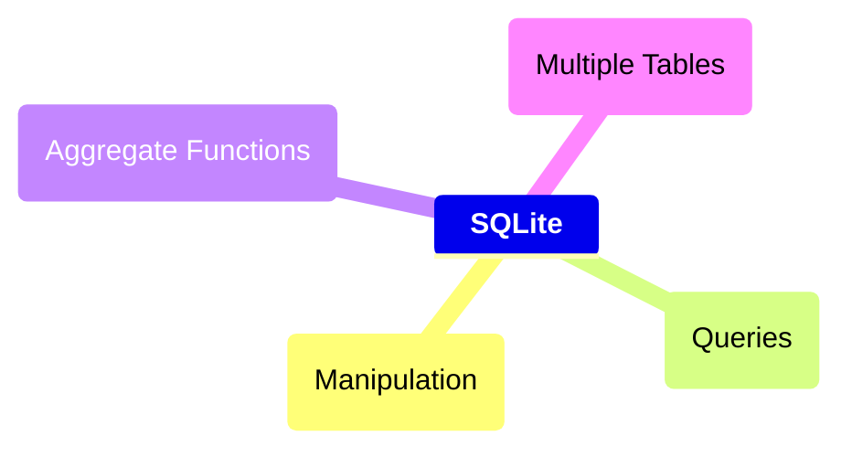
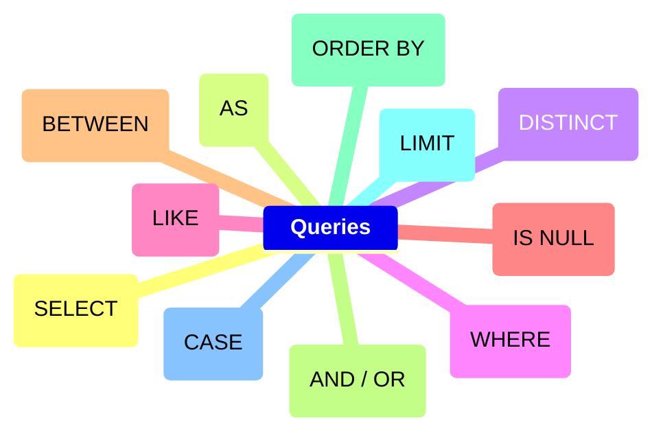
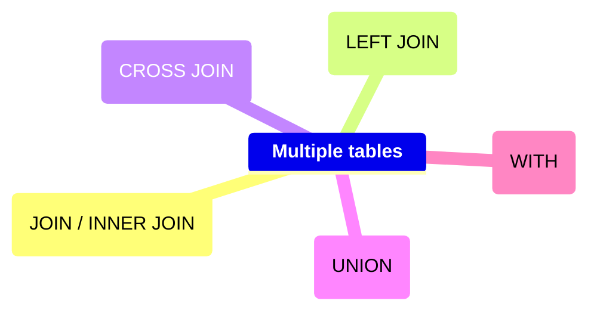

## Course's Mind map



<details>
	<summary><h2>Intro</h2></summary>
	
 ### What is SQLite

  #### SQLite é um moto de banco de dados. Ele permite usuários interagir com um banco de dados relacional. Em SQLite, o banco de dados é armazenado em um único arquivo. Esse fato permite uma grande acessibilidade: copiar um banco de dados não é mais complicado do que copiar um arquivo qualquer.

<br>

 ### Drawbacks To SQLite

  #### A sua característica de ser portável o faz uma escolha ruim para quando muito usuários estão atualizando a tabela ao mesmo tempo (para manter integridade, somente um usuário por vez pode alterar a tabela). Ele também não oferece tantas funcionalidades quantos outros motores de banco de dados. Por último, SQLite não valida tipo de dados: onde muito bancos de dados rejeitariam dados que não estão conforme o esquema da tabela, SQLite permite a usuários armazenar dados de qualquer tipo em qualquer coluna.

<br>

 ### Uses for SQLite

  #### Mesmo considerando os pontos negativos. Os benefícios de ser capaz de acessar e manipular um banco de dados sem envolver uma aplicação servidor são enormes. SQLite é usado mundialmente onde faz sentido armazenar o banco de dados no mesmo dispositivo da aplicação.

<br>

 ### Introduction to SQL

  #### SQL, Structured Query Language, é uma linguagem de programação projetada para gerenciar dados armazenados em um banco de dados relacional. Os comando cobertos nesse curso utiliza SQLite Relational Database Management System.

<br>

 ### Relational Database

  #### Um banco de dados relacional é um banco de dados que organiza informação em uma ou mais tabelas. Uma tabela é uma coleção de dados organizados em linhas e colunas. Tabelas são também conhecidas como relações. Uma coluna é um conjunto de características de um tipo particular. Uma linha é um registro único em uma tabela.

</details>

<details>
	<summary><h2>Manipulation</h2></summary>


 ### Statements

  #### O código abaixo é uma declaração. Uma declaração é um texto que banco de dados reconhece como um comando válido. Declarações sempre terminam con ponto e vírgula.

```sql
CREATE TABLE table_name
(
   column_1 data_type, 
   column_2 data_type, 
   column_3 data_type
);
```

   ##### 1. <code>CREATE TABLE</code> é um comando. Comandos performam tarefas específicas em SQL. Por convenção, comando são escritos em caxa-alta.
   ##### 2. <code>table_name</code> se refere ao nome da tabela o qual o comando se aplica.
   ##### 3. <code>column_1 data_type, column_2 data_type, column_3 data_type</code> são parâmetros. Parâmetros são uma lista de colunas, tipos de dados ou valores passados para um comando como um argumento.

<br>


 ### CREATE

  #### Declarações <code>CREATE</code> nos permite criar uma nova tabela em um banco de dados. VOcê pode usar <code>CREATE</code> a qualquer momento para criar uma nova tabela do princípio.

```sql
CREATE TABLE celebs
(
   id INTEGER, 
   name TEXT, 
   age INTEGER
);
```

   ##### 1. <code>CREATE TABLE</code> é um comando que conta ao SQL que você quer criar uma nova tabela
   ##### 2. <code>celebs</code> é o nome da tabela;
   ##### 3. <code>(id INTEGER, name TEXT, age INTEGER)</code> é uma lista de parâmetros definindo cada coluna ou atributo na table e seu tipo de dado.

- <code>id</code> é a primeira coluna da tabela e armazena valores do tipo <code>INTEGER</code>.
- <code>name</code> é a segundo coluna e armazena valores do tipo <code>TEXT</code>.
- <code>age</code> é a terceira coluna e armazena valores do tipo <code>INTEGER</code>.

<br>


 ### INSERT

  #### A declaração <code>INSERT</code> insere uma nova linha na coluna. Nós podemos usar esse comando sempre que for necessário adicionar novas colunas.

```sql
INSERT INTO celebs (id, name, age) 
VALUES (1, 'Justin Bieber', 29);
```

   ##### 1. <code>INSERT INTO</code> é o comando que adiciona os dados a uma especificada coluna.
   ##### 2. <code>VALUES</code> é comando que indica os valores que estão sendo inseridos para cada coluna na ordem criada.

<br>


 ### SELECT

  #### A declaração <code>SELECT</code> é utilizada para recuperar dados de uma banco de dados.

```sql
SELECT name FROM celebs;
```

   ##### 1. <code>SELECT</code> é o comando que indica que essa declaração é uma consulta.
   ##### 2. <code>FROM celebs</code> especifica o nome da tabela da qual os dados foram consultados.

<br>


```sql
SELECT * FROM celebs;
```

   ##### <code>*</code> é um caractere coringa especial que estivemos usando até então. Ele nos permite selecionar toda coluna em uma tabela sem ter que nomear cada uma individualmente.

<br>


 ### ALTER

  #### A declaração <code>ALTER TABLE</code> juntamente com <code>ADD COLUMN</code>, <code>RENAME TO</code> e <code>DROP</code> permitem alterar a estrutura de uma tabela.

```sql
ALTER TABLE celebs 
ADD COLUMN twitter_handle TEXT;
```

   ##### 1. <code>ALTER TABLE</code> é o comando que permite você fazer mudanças específicas.
   ##### 2. <code>ADD COLUMN</code> é o comando que permite você adicionar coluna.
   ##### 3. <code>RENAME TO</code> é o comando que permite alterar o nome de uma tabela ou coluna;
   ##### 5. <code>DROP</code> é o comando que permite excluir uma coluna de um tabala;

```sql
ALTER TABLE celebs
RENAME TO celebrities;
```
   ##### Alterando nome da tabela

```sql
ALTER TABLE celebs
RENAME expenses TO cost; 
```
   ##### Alterando nome da coluna

```sql
ALTER TABLE celebrities
DROP COLUMN cost;
```
   ##### Excluindo a coluna cost

<br>


 ### UPDATE

  #### A declaração <code>UPDATE SET</code> permite editar uma linha de uma coluna da tabela com um novo valor que for passado para a declaração.

```sql
UPDATE celebs SET twitter_handle = '@taylorswift13' WHERE id = 4; 
```

   ##### 1. <code>UPDATE</code> é o comando que edita uma linha da tabela.
   ##### 2. <code>SET</code> é o comando que especifica a coluna e depois o parâmetro (entre aspas ou não a depender do tipo de dado) que ficará no lugar do anterior.
   ##### 3. <code>WHERE</code> é comando que especifica qual linha da coluna selecionada será alterada se o parâmetro for verdadeiro. Apesar de não ser necessário para o restante do comando funcionar, se não for acrescentado, todas as linhas da coluna possuirão o mesmo valor passado como parâmetro. Por isso mesmo, é necessária a utilização de um valor que seja único para cada linha da tabela.

<br>


 ### DELETE

  #### A declaração <code>DELETE FROM</code> apaga uma ou mais linhas de uma tabela.

```sql
DELETE FROM celebs 
WHERE twitter_handle IS NULL;
```

   ##### 1. <code>DELETE FROM</code> é o comando que permite deletar uma ou mais linhas de uma tabela.
   ##### 2. <code>WHERE</code> especifica uma ou mais linhas que serão deletadas conforme o parâmetro for verdadeiro.
   ##### 3. <code>IS NULL</code> é o parâmetro que será analisado com verdadeiro ou não.

<br>


 ### Constraints

  #### As restrições são utilizadas para informar ao sistema de banco de dados que certas colunas possuem características adicionais e que essas características devem ser seguidas.

```sql
CREATE TABLE celebs
(
   id INTEGER PRIMARY KEY, 
   name TEXT UNIQUE,
   date_of_birth TEXT NOT NULL,
   date_of_death TEXT DEFAULT 'Not Applicable'
);
```

   ##### 1. <code>PRIMARY KEY</code> é a restrição que define uma coluna da tabela como o identificador universal da própria tabela e que não pode ser repetido. Somente é permitida uma restrição dessa por tabela.
   
   ##### 2. <code>UNIQUE</code> é a restrição que diz que determinada linha de uma coluna deve ter valor único. Tem semelhança com <code>PRIMARY KEY</code>, mas possui a mesma função.
   
   ##### 3. <code>NOT NULL</code> é a restrição que impede a inserção de nova linha em branco na coluna em questão que sejam em branco.
   
   ##### 4. <code>DEFAULT</code> é a restrição que declara outro valor padrão caso, na hora de inserção de uma nova linha, esse valor esteja em branco

<br>

</details>


<details>
	<summary><h2>Queries</h2></summary>



 ### Introduction
 
  #### Um dos principais propósitos de uma linguagem SQL é recuperar informação armazenada no banco de dados. Isso é comumente conhecido como consulta. Consultas permitem-nos comunicar com um banco de dados perguntando e ele devolvendo um conjunto de resultados com dados relevantes.

```sql
SELECT * FROM movies;
```

<br>

 
 ### SELECT
 
  #### Anteriormente, nós aprendemos que o comando <code>SELECT</code> é usado toda vez que você quer consultar dados de um banco de dados. O <code>*</code> significa que todas as colunas da tabela <code>movies</code> serão recuperadas. Suponha que nós estamos somente interessados em duas das colunas. Nós podemos selecionar colunas individualmente pelos seus nomes.

```sql
SELECT column1, column2 FROM table_name;
```

<br>


### AS

  #### <code>AS</code> é a declaração que permite modificar o nome da coluna somente na hora da exibição, mas não modificar de fato na tabela. Está mais para um recurso visual. Ademais, cada coluna pode ter seu nome modificado na consultado individualmente. 

```sql
SELECT name AS 'Titles'
FROM movies;
```

   ##### 1. No caso acima, ao invés de exibir name será exibido Titles.

```sql
SELECT name AS 'Titles', year AS 'Ano de lançamento'
FROM movies;
```

   ##### 1. No caso acima, ao invés de exibir name e year será exibido Titles e Ano de Lançamento.

<br>


 ### DISTINCT

  #### A declaração <code>DISTINCT</code> é utilizado para exibir linhas de uma coluna que possuem valores não repetidos.

```sql
SELECT DISTINCT year FROM movies;
```

   ##### 1. No caso acima, todas as linhas onde a coluna year possui valores distintos.

<br>


 ### WHERE

  #### <code>WHERE</code> é a declaração que especifica qual linha (ou linhas) da coluna selecionada será alterada se o parâmetro seguinte for verdadeiro.

```sql
SELECT * FROM movies WHERE year > 1999;
```

   ##### 1. Podem ser utilizados os seguintes operadores relacionais em conjunto com <code>WHERE</code>:

- <code>=</code>: igual a
- <code>!=</code>: diferente de
- <code>></code>: maior que
- <code><</code>: menor que
- <code>>=</code>: maior ou igual a
- <code><=</code>: menor ou igual a

<br>


 ### LIKE
 
  ##### O comando <code>LIKE</code> é utilizado em conjunção com <code>SELECT FROM</code> e <code>WHERE</code> para filtrar os dados de uma coluna semelhante ao parâmetro.

```sql
SELECT * FROM movies WHERE name LIKE 'A%';

SELECT * FROM movies WHERE name LIKE '%A';

SELECT * FROM movies WHERE name LIKE '%man%';

SELECT * FROM movies WHERE name LIKE 'B%A';
```

   ##### 1. Utilizando o caractere coringa <code>%</code> no _início_ do parâmetro, o comando vai procurar qualquer linha que começe com a letra 'A' ou 'a', tanto na forma caixa-alta ou caixa-baixa. É possível buscar por linhas com terminem com mais de um caractere.
   
   ##### 2. Utilizando o caractere coringa <code>%</code> no _final_ do parâmetro, o comando vai procurar qualquer linha que termine com a letra 'A' ou 'a', tanto na forma caixa-alta ou caixa-baixa. É possível buscar por linhas com terminem com mais de um caractere.
   
   ##### 3. Utilizando o caractere coringa <code>%</code> no _início e fim_ do parâmetro, o comando vai procurar qualquer linha que contenha o texto 'man', tanto na forma caixa-alta ou caixa-baixa.
   
   ##### 4. Utilizando o caractere coringa <code>%</code> no _meio_ do parâmetro, o comando vai procurar qualquer linha que começe com 'B' e termine com 'A', tanto na forma caixa-alta ou caixa-baixa.

<br>


 ### NULL (IS NULL, IS NOT NULL)
 
  #### Esse comando serve para identificar se determinada linha de uma coluna possui ou não o valor em branco, ou nulo que não passado no momento de inserção dos dados.

```sql
SELECT name FROM movies WHERE imdb_rating IS NOT NULL;

SELECT name FROM movies WHERE genre IS NULL;
```
   ##### 1. Com o primeiro comando do código acima vão ser exibidas a linhas da coluna imd_rating que não sejam nulas.
   ##### 2. Com o segundo comando do código acima vão ser exibidas a linhas da coluna genre que sejam nulas.


<br>

 
 ### BETWEEN

   ##### Essa declaração serve para consultar valores que estejam no alcance delimitado pela consulta, utilizando sempre o comando <code>WHERE</code> para auxiliar quais dados buscar. Quando do uso, o comportamento desse comando é diferente de letras para números.

```sql
SELECT * FROM movies WHERE year BETWEEN 1990 AND 1999;
```

   ##### Irá pesquisar os anos de 1990 até 1999 inclusive

<br>

```sql
SELECT * FROM movies WHERE name BETWEEN 'A' AND 'J';
```

   ##### Irá pesquisar os nomes dos filmes que comecem entre A e J não inclusivo, ou seja, até a letra I

<br>

```sql
SELECT * FROM movies WHERE year < 1985;
```

   ##### Também é possível utilizar operadores relacionais no lugar do comando <code>BETWEEN</code>. O código acima irá retornar todos os filmes com o ano de lançamento menor que 1985

<br>

 ### AND e OR

<p>Assim como na programação, é possível fazer comparações lógicas entre condições na linguagem SQL. Quando utilizando <code>AND</code> somente é feita a consulta quando as duas condições são verdadeiras. Quando <code>OR</code> basta que apena uma das condições seja verdadeira para a consulta ser realizada.</p>

```sql
SELECT * FROM movies WHERE year BETWEEN 1990 AND 1999 AND genre = 'romance';
```

_Comparação feita entre <code>BETWEEN 1990 AND 1999</code> e <code>genre = 'romance'</code>_

<br>

```sql
SELECT * FROM movies WHERE year < 1985 OR genre = 'horror';
```

_Comparação feita entre <code>year < 1985</code> ou <code>genre = 'horror'</code>_

<br>


 ### ORDER BY
 
  #### Esse comando é utilizado para ordenar as linhas da tabela através do uso de uma coluna como referência. Utilize os comandos <code>ASC</code> para ordenação ascendente e <code>DESC</code> para ordenação descendente. Por padrão a ordenação é feita do menor para o maior, seja número ou texto.

```sql
SELECT * FROM movies ORDER BY name;
```

   ##### Nesse caso, as linhas serão ordenadas em ordem alfabética

<br>

```sql
SELECT * FROM movies WHERE imdb_rating > 8 ORDER BY year DESC;
```

   ##### Note que o <code>ORDER BY</code> vem depois de <code>WHERE</code> (se estiver presente)

<br>

```sql
SELECT * FROM movies WHERE year BETWEEN 1990 AND 1999 AND genre = 'romance' ORDER BY year;
```

  #### É possível aplicar ordem após condições

<br>


 ### LIMIT

   ##### Possui a função de limitar a quantidade de linhas que serão buscadas na consulta.

```sql
SELECT * FROM movies WHERE imdb_rating > 8 LIMIT 10;
```

   ##### É possível utilizar com ou sem outros comandos de consulta.

<br>


 ### CASE

   ##### Essa declaração permite criar uma avaliação de múltiplas condições de maneira mais organizada. E permite, também, nova ação caso seja verdadeira tal condição. Entre o comando <code>WHEN</code> e <code>THEN</code> é possível diferentes tipos de condições. Em teoria, não há limite para quais combinações, porém, cuidado, pois elas podem ficar redundantes.

```sql
SELECT name,

CASE

  WHEN imdb_rating > 8 THEN 'Above average'

  WHEN imdb_rating > 9 THEN 'Crazy shit'

  WHEN imdb_rating > 6 THEN 'Good at best'

  ELSE 'Dumpster fire'

END AS 'Notinhas'

FROM movies;
```

   ##### 1. <code>CASE</code> é utilizado para criar múltiplas condições. 
   ##### 2. <code>WHEN</code> é a condição utilizada para avaliar se um conjunto de comparações lógicas são verdadeiras.
   ##### 3. <code>THEN</code> caso seja a comparação verdadeira, retorne alguma informação na coluna adicional.
   ##### 4. <code>ELSE</code> caso nenhuma comparação lógica seja verdadeira, retorne a consulta com a alguma informação na coluna adicional.
   ##### 5. <code>END</code> declaração utilizada para dar fim às múltiplas condições iniciada pelo <code>CASE</code> e dar nome à coluna adicional que irá retornar as informações.

<br>


</details>


<details>
	<summary><h2>Aggregate Functions</h2></summary>

 ```mermaid
mindmap
	**Aggregate functions**
		(COUNT)
		(SUM)
		(MAX / MIN)
		(AVG)
		(ROUND)
		(GROUP BY)
		(HAVING)
```

  #### Funções agregadores são utilizadas no SQL para dar dinamismo à linguagem e fornecer mais do que apenas definição, manipulação e extração de dados, por operações matemáticas.

 <br>
 
 ### COUNT

  #### O comando <code>COUNT</code> é utilizado para fazer a contagem de quantas linhas (incluindo linhas com valores nulos) há em uma tabela, ao utilizar o caractere <code>*</code> como argumento. Se for utilizado o nome de uma coluna, a contagem será feita somente com linhas que não possuírem valores nulos.

 ```sql
SELECT COUNT(*) FROM table_name;

SELECT COUNT(column_name) FROM table_name;
 ```

<br>

 ### SUM
 
  #### O comando <code>SUM</code> é utilizado para somar todos os valores da coluna que for informada no argumento da consulta.

```sql
SELECT SUM(downloads) FROM fake_apps;
```

<br>

 ### MAX / MIN
 
  #### Os comandos <code>MAX</code> e <code>MIN</code> retornam os maiores e menores valores da coluna que for informada no argumento da consulta.

```sql
SELECT MAX(downloads) FROM fake_apps;

SELECT MIN(downloads) FROM fake_apps;
```

<br>

 ### AVG
 
  #### O comando <code>AVG</code> retorna a média dos valores da coluna que for informada no argumento da consulta.

```sql
SELECT AVG(downloads) FROM fake_apps;
```

<br>

 ### ROUND

  #### O comando <code>ROUND</code> é utilizado para aplicar dupla precisão aos números. Ele possui dois argumentos: o primeiro é a coluna que possui os valores e o segundo é o número de casas decimais.

```sql
SELECT ROUND(price, 2) FROM fake_apps;
```

```sql
SELECT ROUND(AVG(price), 2) FROM fake_apps;
```
   ##### 1. O código logo acima faz com que um dos parâmetros do comando <code>ROUND</code> seja a média de preço, utilizando o comando <code>AVG</code>. O segundo argumento é quantidade casas decimais.

<br>

 ### GROUP BY

  #### O comando <code>GROUP BY</code> é utilizado para agrupar resultados de consultas feitas em uma ou mais coluna utilizando as próprias funções agregadoras. A função dele é arranjar a consulta de dados idênticos em grupos.

```sql
SELECT AVG(imdb_rating)
FROM movies
WHERE year = 1999;

SELECT AVG(imdb_rating)
FROM movies
WHERE year = 2000;

SELECT AVG(imdb_rating)
FROM movies
WHERE year = 2001;
```

   ##### 1. Exemplo sem <code>GROUP BY</code>.

```sqlite
SELECT year, AVG(imdb_rating) FROM movies GROUP BY year;
```

   ##### 2. Exemplo com <code>GROUP BY</code>: o código acima retorna a coluna <code>year</code> e uma coluna da média das notas agrupadas por cada ano.

```sql
SELECT imdb_rating, COUNT(*) FROM movies GROUP BY imdb_rating;
```

   ##### 3. Exemplo com <code>GROUP BY</code>: o código acima irá retornar quantas vezes uma nota se repete no banco de dados. Ou seja, cada vez que a nota aparecer no banco de dados ela será computada. Por exemplo, se houverem 10 notas 4.2 elas serão agrupadas (não somadas) numa só nota e contadas quantas vezes essa nota (e outras) se repetem.

<br>

 ### Column references
 
  #### É possível também utilizar números ao invés dos nomes das colunas para referenciar os agrupamentos e ordenamentos numa consulta.

```sql
SELECT COUNT(*) AS 'total_movies', rating FROM movies GROUP BY 2 ORDER BY 1;
```

  ##### 1. No código acima, <code>GROUP BY 2</code> está referenciando a segunda coluna da consulta <code>rating</code>, já <code>ORDER BY 1</code> está referenciando a primeira coluna da consulta <code>COUNT(*) AS 'total_movies'</code>.

<br>

 ### HAVING

  #### O comando <code>HAVING</code> é utilizado para filtrar resultados, semelhante em parte ao comando <code>WHERE</code>. Porém, ao invés de filtras linhas, ele filtra grupos, os mesmos grupos criados pelo comando <code>GROUP BY</code>.

```sql
SELECT year, COUNT(*) FROM movies GROUP BY 1 HAVING COUNT(*) > 2;
```

  ##### 1. No código acima, irá retornar year, e a contagem de quantos filmes tiveram por ano, contanto que seja maior que 2. Ou seja, filtrando o resultado das funções agregadas maiores que 2; 


</details>


<details>
	<summary><h2>Multiple Tables</h2></summary>



 ### JOIN

  #### O comando <code>JOIN</code> é utilizado fundamentalmente para unir tabelas num banco de dados a partir de um ou mais valores em comum. Para isso, é necessário ser feito o uso das restrições <code>PRIMARY KEY</code> e <code>FOREIGN KEY</code>. Esse comando possibilita uma análise dos dados minimamente relevante.

```sql
SELECT * FROM orders JOIN customers ON orders.customer_id = customers.customer_id;
```

   ##### 1. <code>SELECT * FROM orders</code> inicia a consulta a partir da tabela <code>orders</code>.
   ##### 2. <code>JOIN customers</code> faz a união da tabela <code>orders</code> com a tabela da tabela <code>customers</code>. O comando <code>INNER JOIN</code> é o comportamento padrão, quando somente <code>JOIN</code>.
   ##### 3. <code>ON orders.customer_id = customers.customer_id</code> essa união/junção será baseada na igualdade dos valores dentro das colunas nas duas tabelas.

```sql
SELECT orders.order_id, customers.customer_name FROM orders
    INNER JOIN customers ON orders.customer_id = customers.customer_id;
```

   ##### 1. É possível também referenciar as colunas das tabelas utilizando o nome da tabela, o caractere <code>.</code> e o nome da coluna.
   ##### 2. Esse tipo de referência também evita ambiguidade no momento da consulta, pois destaca a qual tabela pertence determinada coluna: <code>orders.customer_id</code> e <code>customers.customer_id</code> possuem colunas com o mesmo nome.

```sql
SELECT subscriptions.description AS 'Categoria',

    COUNT(*) AS 'Quantidade magazines compradas por categoria',
    
    ROUND(AVG(subscriptions.price_per_month), 2) AS 'Média de preço',
        
    ROUND(AVG(subscriptions.subscription_length), 2) AS 'Duração média da inscrição',
        
    SUM(subscriptions.price_per_month) AS 'Receita Anual total por categoria',
        
    SUM(subscriptions.price_per_month) / 12 AS 'Receita mensal total por categoria'

FROM orders JOIN subscriptions ON orders.subscription_id = subscriptions.subscription_id GROUP BY 1;
```

   ##### 1. É possível também utilizar funções agregadoras na junção das consultas, juntamente com referências. Nesse exemplo o <code>GROUP BY</code> poderia ser agrupado por <code>subscriptions.description</code> que teria o mesmo resultado. Se for por número, será conforme a ordem das colunas. As primeiras colunas serão da tabela consultada, depois a tabela unida e por fim a coluna com a contagem.

<br>

 ### LEFT JOIN

  #### Semelhante ao comando <code>JOIN</code>, o comando <code>LEFT JOIN</code> faz a junção/união de duas tabelas ou mais. Porém, esse comando permite manter na consulta as linhas da tabela primária (*LEFT*), mesmo que não haja correspondentes na tabela secundária.

```sql
SELECT * FROM newspaper LEFT JOIN online ON newspaper.id = online.id;
```

   ##### 1. Nessa consulta, as linhas e colunas da tabela <code>newspaper</code> serão mantidas na consulta mesmo não havendo a mesma quantidade de linhas e colunas correspondentes na tabela <code>online</code>.
   ##### 2. Dessa maneira, algumas linhas da tabela <code>online</code> estarão com valores nulos.

```sql
SELECT * FROM newspaper LEFT JOIN online ON newspaper.id = online.id WHERE online.id IS NULL;
```

   ##### 1. Nesse caso, somente serão exibidos as linhas que possuem os valores nulos na tabela <code>online</code>.

<br>

 ### Primary Key vs. Foreign Key

  #### Os dois modos mais utilizados para criar relações entre tabelas dentro um banco de dados SQL é utilizando as restrições <code>PRIMARY KEY</code> e <code>FOREIGN KEY</code>. Com essas restrições é possível relacionar diretamente múltiplas tabelas simultâneamente, criando assim um banco de dados conciso e consistente. Geralmente, essas e outras restrições são aplicadas na criação de uma tabela. Porém, poder ser modificadas com o comando <code>ALTER TABLE</code>.

   ##### 1. <code>PRIMARY KEY</code> é a restrição que define uma coluna da tabela como o identificador universal da própria tabela e que não pode ser repetido. Somente é permitida uma restrição dessa por tabela.

   ##### 2. <code>FOREIGN KEY</code> é a restrição que faz referência a uma <code>PRIMARY KEY</code> em outra tabela. Ou seja, toda <code>FOREIGN KEY</code> é antes uma <code>PRIMARY KEY</code> criada em outra tabela.

<br>

 ### CROSS JOIN

  #### O comando <code>CROSS JOIN</code> é utilizado para combinar múltiplas colunas e linhas de uma tabela com outra tabela sem qualquer restrição. 

```sql
SELECT * FROM newspaper CROSS JOIN months;
```

   ##### 1. Nesse caso acima, todas as colunas da tabela <code>newspaper</code> serão combinadas com todas as colunas da tabela <code>online</code>. Dessa forma, é possível fazer múltiplas combinações de consulta.

```sql
SELECT COUNT(*) AS 'Q° de assinaturas iniciadas por mês',
CASE

  WHEN start_month = 1 THEN 'Janeiro'
  WHEN start_month = 2 THEN 'Fevereiro'
  WHEN start_month = 3 THEN 'Março'
  WHEN start_month = 4 THEN 'Abril'
  WHEN start_month = 5 THEN 'Maio'
  WHEN start_month = 6 THEN 'Junho'
  WHEN start_month = 7 THEN 'Julho'
  WHEN start_month = 8 THEN 'Agosto'
  WHEN start_month = 9 THEN 'Setembro'
  WHEN start_month = 10 THEN 'Outubro'
  WHEN start_month = 11 THEN 'Novembro'
  WHEN start_month = 12 THEN 'Dezembro'

  ELSE 'NULO'

END 'Mês'

FROM newspaper GROUP BY 2 ORDER BY start_month;
```

   ##### 1. Também seria possível selecionar somente algumas colunas e/ou utilizar funções agregadoras.

<br>

 ### UNION

  #### O comando <code>UNION</code> é utilizado para unir consultas individuais de tabelas distintintas numa só consulta.

```sql
SELECT * FROM newspaper UNION  SELECT * FROM online;
```

   ##### 1. 
</details>