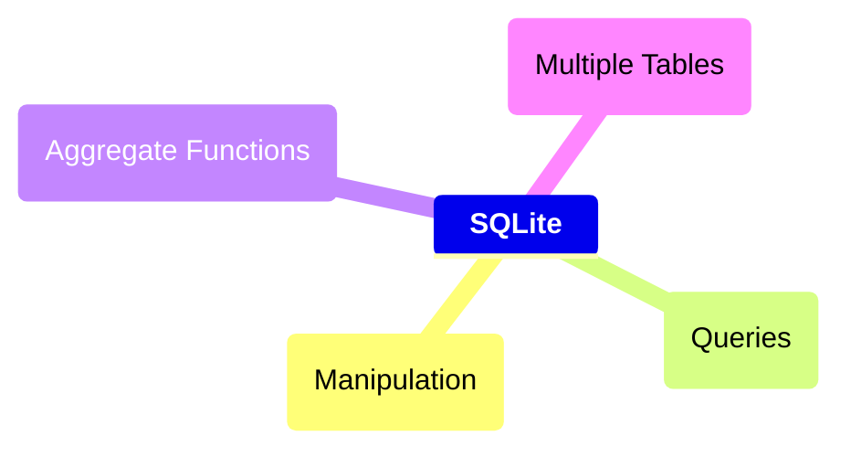

# Course Diagram:

## Useful Links
https://www.sqlitetutorial.net/tryit/

https://sqliteonline.com/

	
<h2>Manipulation</h2>

 

	
<h2>Queries</h2>

	
<h2>Aggregate Functions</h2>

	
<h2>Multiple Tables</h2>

