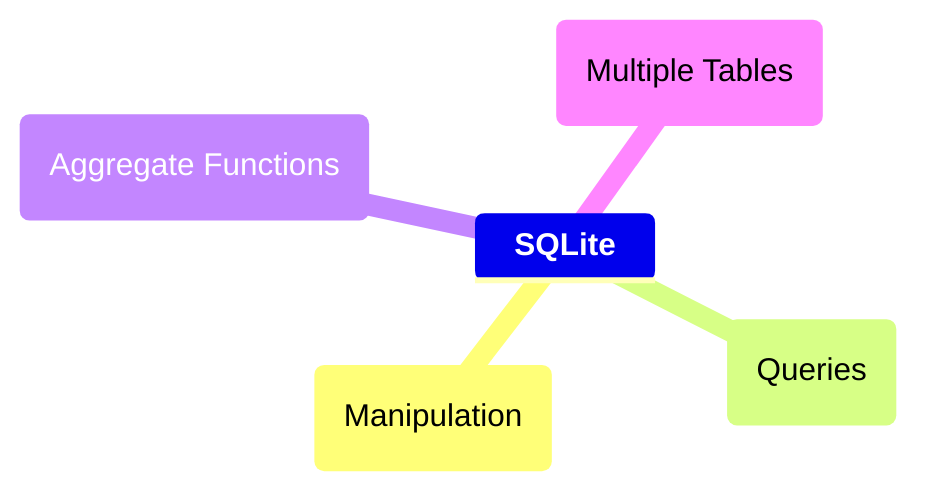

# Useful Links
https://www.sqlitetutorial.net/tryit/

https://sqliteonline.com/

# Course Mind map



<details>
	<summary><h2>Manipulation</h2></summary>


### What is SQLite

<p style ="text-align: justify">SQLite é um moto de banco de dados. Ele permite usuários interagir com um banco de dados relacional. Em SQLite, o banco de dados é armazenado em um único arquivo. Esse fato permite uma grande acessibilidade: copiar um banco de dados não é mais complicado do que copiar um arquivo qualquer.</p>

<br>

### Drawbacks TO SQLite

<p style ="text-align: justify">A sua característica de ser portável o faz uma escolha ruim para quando muito usuários estão atualizando a tabela ao mesmo tempo (para manter integridade, somente um usuário por vez pode alterar a tabela). Ele também não oferece tantas funcionalidades quantos outros motores de banco de dados. Por último, SQLite não valida tipo de dados: onde muito bancos de dados rejeitariam dados que não estão de acordo com o esquema da tabela, SQLite permite a usuários armazenar dados de qualquer tipo em qualquer coluna.</p>

<br>

### Uses for SQLite

<p style ="text-align: justify">Mesmo considerando os pontos negativos. os benefícios de ser capaz de acesar e manipular um banco de dados sem envolver uma aplicação servidor são enormes. SQLite é usado mundialmente onde faz sentido armazenar o banco de dados no mesmo dispositivo da aplicação.</p>

<br>

### Introduction to SQL

<p  style ="text-align: justify">SQL, Structured Query Language, é uma linguagem de programação projetada para gerenciar dados armazenados em um banco de dados relacional. Os comando cobertos nesse curso utiliza SQLite Relational Database Management System.</p>

<br>

### Relational Database

<p  style ="text-align: justify">Um banco de dados relacional é um banco de dados que organiza informação em uma ou mais tabelas. Uma tabela é uma coleção de dados organizados em linhas e colunas. Tabelas são também conhecidas como relações.</p>

<p  style ="text-align: justify">Uma coluna é um conjunto de características de um tipo particular. Uma linha é um registro único em uma tabela.</p>

<br>

### Statements

<p  style ="text-align: justify">O código abaixo é uma declaração. Uma declaração é um texto que banco de dados reconhece como um comando válido. Declarações sempre terminam con ponto e vírgula.</p>

```sql
CREATE TABLE table_name
(
   column_1 data_type, 
   column_2 data_type, 
   column_3 data_type
);
```

_Distrinchando o código acima:_

1. <code>CREATE TABLE</code> é um comando. Comandos performam tarefas específicas em SQL. Por convenção, comando são escrito em caxa-alta.
2. <code>table_name</code> se refere ao nome da tabela o qual o comando se aplica.
3. <code>column_1 data_type, column_2 data_type, column_3 data_type</code> é um parâmetro. Um parâmetro é uma lista de colunas, tipos de dados ou valores que são passados para um comando como sendo um argumento.

<br>

### CREATE

<p  style ="text-align: justify">Declarações <code>CREATE</code> nos permite crair uma nova tabela em um banco de dados. VOcê pode usar <code>CREATE</code> a qualquer momento para criar uma nova tabela do princípio.</p>

```sql
CREATE TABLE celebs
(
   id INTEGER, 
   name TEXT, 
   age INTEGER
);
```

_Distrinchando o código acima:_

1. <code>CREATE TABLE</code> é um comando que conta ao SQL que você quer criar uma nova tabela
2. <code>celebs</code> é o nome da tabela;
3. <code>(id INTEGER, name TEXT, age INTEGER)</code> é uma lista de parâmetros definindo cada coluna ou atributo na table e seu tipo de dado.

	- <code>id</code> é a primeira coluna da tabela e armazena valores do tipo <code>INTEGER</code>.
 	- <code>name</code> é a segundo coluna e armazena valores do tipo <code>TEXT</code>.
  	- <code>age</code> é a terceira coluna e armazena valores to tipo <code>INTEGER</code>.

<br>

### INSERT

<p style ="text-align: justify">O comando <code>INSERT</code> insere uma nova linha na coluna. Nós podemos usar esse comando sempre que for necessário adicionar novas colunas.</p>

```sql
INSERT INTO celebs (id, name, age) 
VALUES (1, 'Justin Bieber', 29);
```

_Distrinchando o código acima:_

1. <code>INSERT INTO</code> é um comando que adiciona a especificada coluna ou colunas.
2. <code>VALUES</code> é comando que indica os valores que estão sendo inseridos para cada coluna na ordem.

<br>

### SELECT

<p style ="text-align: justify">Comendos <ode>SELECT</ode> são utilizados para recupear dados de uma banco de dados.</p>

```sql
SELECT name FROM celebs;
```

_Distrinchando o código acima:_

1. <code>SELECT</code> é o comando que indica que essa declaração é uma consulta.
2. <code>FROM celebs</code> especifica o nome da tabela da qual os dados foram consultados.


```
SELECT * FROM celebs;
```

_Distrinchando o código acima:_

<p style ="text-align: justify"><code>*</code> é um caractere coringa especial que estivemos usando até então. Ele nos permite selecionar toda coluna em uma tabela sem ter que nomear cada uma individualmente.</p>

<br>

### ALTER

<p style ="text-align: justify">A declaração <code>ALTER TABLE</code> juntamente com <code>ADD COLUMN</code> permite adicionar uma nova coluna na tabela.</p>

```sql
ALTER TABLE celebs 
ADD COLUMN twitter_handle TEXT;
```

_Distrinchando o código acima:_

1. <code>ALTER TABLE</code> é o comando que permite você fazer mudanças específicas.
2. <code>ADD COLUMN</code> é o comando que permite você Adicionar coluna.

<br>

### UPDATE

<p style ="text-align: justify">A declaração <code>UPDATE SET;</code> permite editar uma linha de uma coluna da tabela com um novo valor que for passado para a declaração.</p>

```sql
UPDATE celebs SET twitter_handle = '@taylorswift13' WHERE id = 4; 
```

_Distrinchando o código acima:_

1. <code>UPDATE</code> é o comando que edita uma linha da tabela.
2. <code>SET</code> é o comando que especifica a coluna e depois o parâmetro (entre aspas ou não a depender do tipo de dado) que ficará no lugar do anterior.
3. <code>WHERE</code> é comando que especifica qual linha da coluna selecionada será alterada. Apesar de não ser necesário para o restante do comando funcionar, se não for acrescentado, todas as linhas da coluna possuirão o mesmo valor passado como parâmetro. Por isso mesmo, é necessária a utilização de um valor que seja único para cada linha da tabela.


</details>

<details>
	<summary><h2>Queries</h2></summary>

### Introduction

<p style ="text-align: justify">Um dos principais propósitos de uma linguagem SQL é recuperar informação armazenada no banco de dados. Isso é comumente conhecido como consulta. Consultas permitem-nos comunicar com um banco de dados perguntando e ele devolvendo um conjunto de resultados com dados relevantes.</p>

<p>We should get acquainted with the <code>movies</code> table</p>

```sql
SELECT * FROM movies;
```
 
### SELECT

<p style ="text-align: justify">Anteriormente, nós aprendemos que o comando <code>SELECT</code> é usado toda vez que você quer consultar dados de um banco de dados. O <code>*</code> significa que todas as colunas da tabela <code>movies</code> serão recuperadas.</p>

<p style ="text-align: justify">Suponha que nós estamos somente interessados em duas das colunas. Nós podemos selecionar colunas individualmente pelo seus nomes.</p>

```sql
SELECT column1, column2 FROM table_name;
```

</details>

<details>
	<summary><h2>Aggregate Functions</h2></summary>

</details>

<details>
	<summary><h2>Multiple Tables</h2></summary>

</details>
