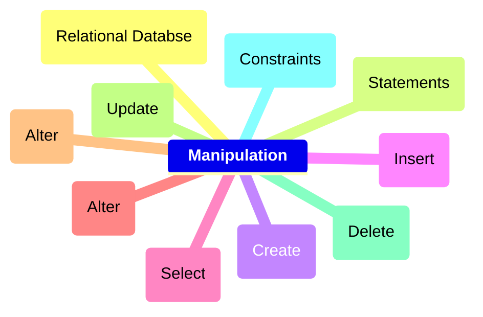
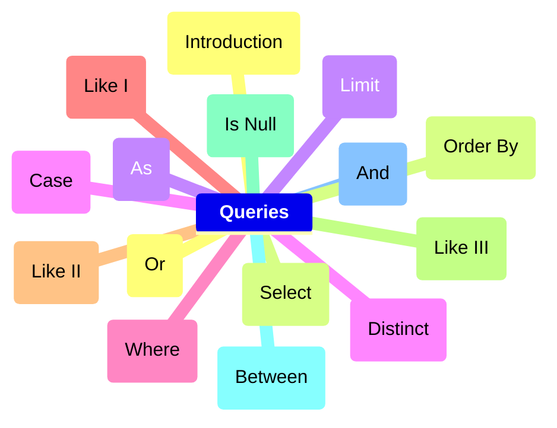

# Course Diagram:

## Parte 1

## Parte 2

## Useful Links
https://www.sqlitetutorial.net/tryit/

https://sqliteonline.com/

 

	 <h2>Intro to SQL</h2>
 

### Introduction to SQL

SQL, Structured Query Language (Linguagem de Consulta Estruturada) é uma linguagem de programação projetada para gerenciar dados armazenados em um banco de dados relacional.

 

### Relational Databases
