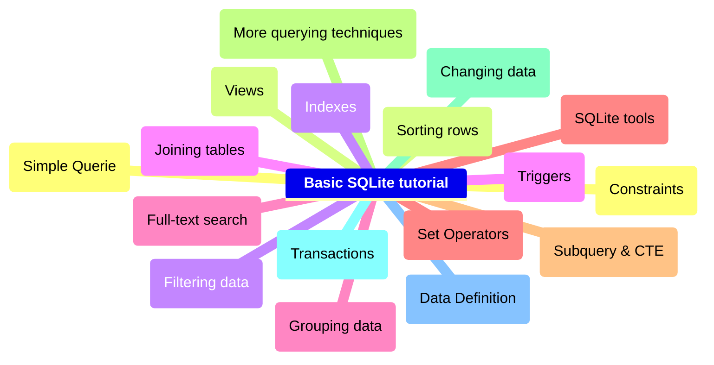

# Course Diagram:

## The bigger picture

```mermaid
mindmap
	**Basic SQLite tutorial**
		(Simple Querie)
		(Sorting rows)
		(Filtering data)
		(Joining tables)
		(Grouping data)
		(Set Operators)
		(Subquery & CTE)
		(More querying techniques)
		(Changing data)
		(Transactions)
		(Data Definition)
		(Constraints)
		(Views)
		(Indexes)
		(Triggers)
		(Full-text search)
		(SQLite tools)
```

## Useful Links
https://www.sqlitetutorial.net/tryit/

https://sqliteonline.com/
