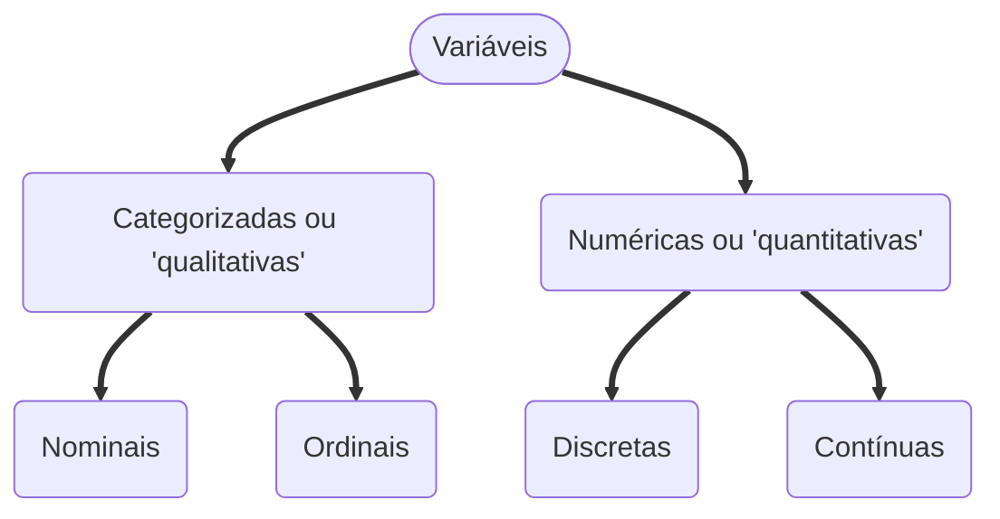

  

    <h2>Capítulo 1: Apresentação de dados em Tabelas</h2>
  

  
Estatística é a ciência que fornece os princípios e os métodos para coleta, organização, resumo, análise e interpretação das informações.

  ### 1.1 Dados e variáveis

  
Uma <i>variável</i> é uma condição ou característica das unidades da população, ou seja, atributos, sejam eles quantitativos ou qualitativos. Já <i>Dado estatístico</i> se refere à toda informação coletada e registrada referente à uma variável. As variáveis podem ser classificadas em dois tipos: 

#### Variáveis Categorizadas

  
Uma variável será qualitativa ou categorizada quando os dados estão distribuídos em categorias que se excluem. Por exemplo, sexo, escolaridade, condição social etc. Há, porém, subdivisões: Nominal e ordinal. Uma variável será categorizada-nominal quando os dados estiverem distribuídos em categorias mutualmente excludentes e sem ordenação: cor do cabelo, tipo sanguíneo etc. Uma variável será categorizada-ordinal quando os dados estiverem distribuídos em categorias mutualmente excludentes e com ordenação: nível de escolaridade, categorias da CNH etc.

#### Variáveis Numéricas

Uma variável será quantitativa ou numérica quando os dados estão representados por números, por exemplo, idade, data de nascimento etc. Há, porém, subdivisões: Nominal e Ordinal. Uma variável é numérica-discreta quando os dados não podem assumir diversos valores em um determinado intervalo: número de filhos, altura etc. Uma variável é numérica-contínua quando os dados podem assumir diversos valores em um determinado intervaldo: peso, taxas glicêmicas etc.

  

    <h2>Capítulo 2: Apresentação de dados em Gráficos</h2>
  

