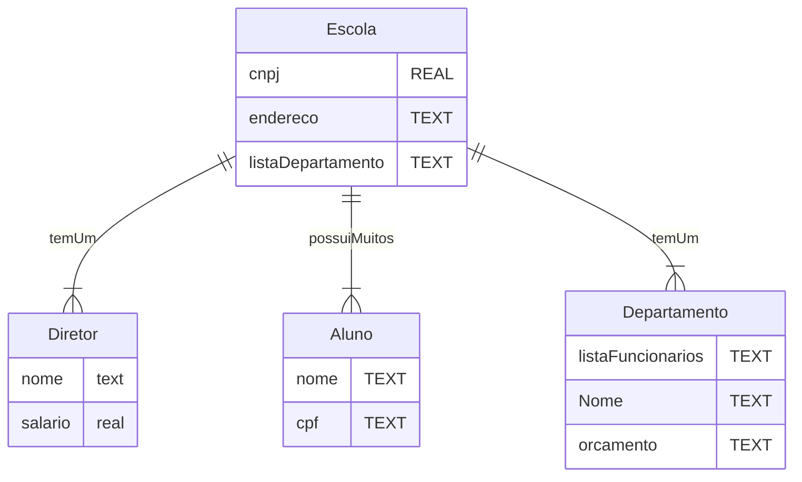

# Sintax

## Mind Maps

```
mindmap
  **HTML-CSS**
    (Semantics)
    (Accessibility)
    (Headings)
    (Boilerplate)
    (Blank space and comments)
    (Paragraphs)
    (Lists)
    (HTML validity)
    (Landmarks)
    (Strong and em)
    (Images)
    (Intro CSS)
    (CSS Inheritance)
```
_Add 3 backsticks at the beginning and end of the code block with mermaid to highlight the code_

```
mindmap
  **HTML-CSS**
    (Semantics)
    (Accessibility)
    (Headings)
  **JavaScript**
    (Numbers)
    (Strings)
```

_Use indentaion to create hierarchy between topics_
### Shapes


```
mindmap
    id[I am a square]

mindmap
    id(I am a rounded square)

mindmap
    id((I am a circle))

mindmap
    id))I am a bang((

mindmap
    id)I am a cloud(

mindmap
    id{{I am a hexagon}}

mindmap
    I am the default shape

```

<br>

## EMR diagrams


