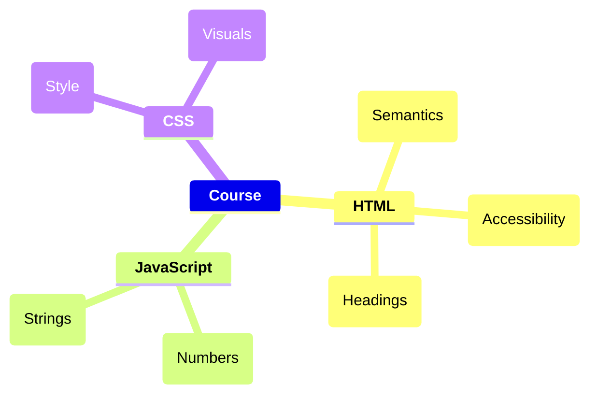
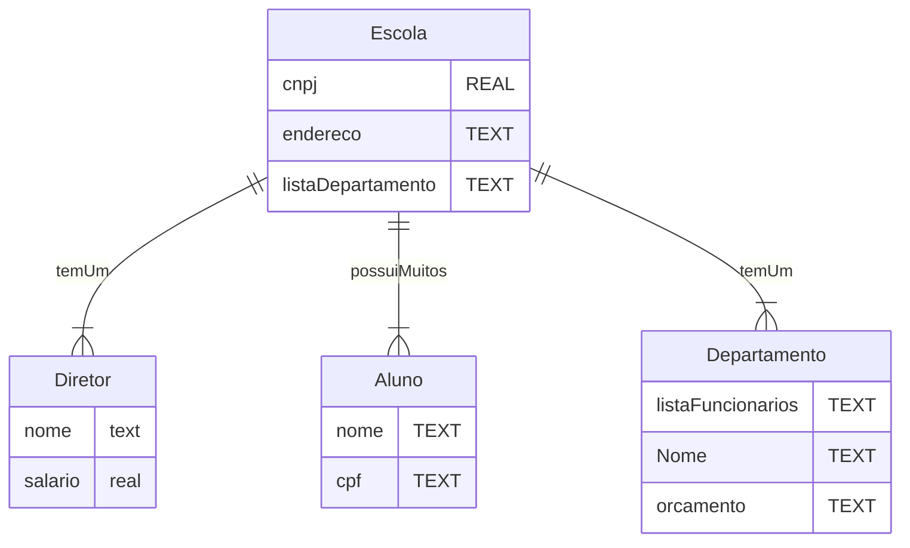
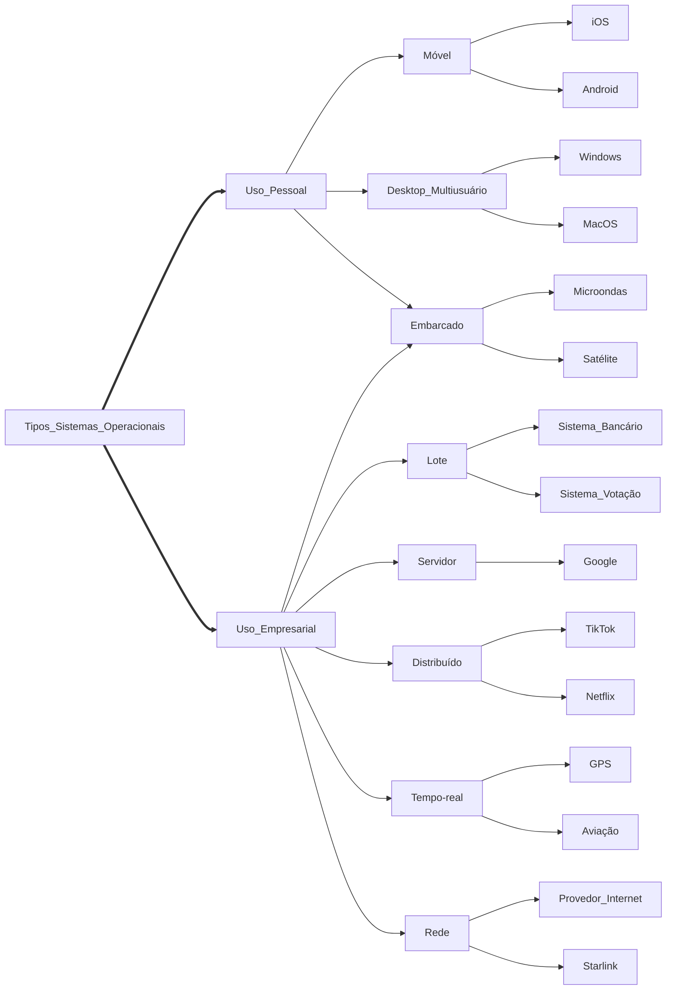
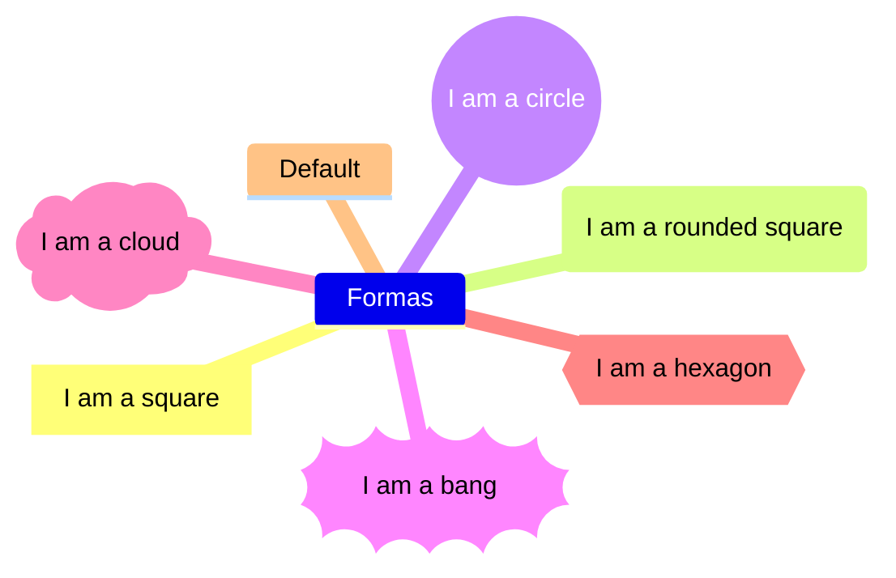

# Sintax

<details>
	<summary><h2>Mindmaps</h2></summary>

### Simple Mindmap

```
mindmap
	**Course**
		**HTML**
			(Semantics)
			(Accessibility)
			(Headings)
		**JavaScript**
			(Numbers)
			(Strings)
		**CSS**
			(Style)
			(Visuals)
```




### Shapes

```
mindmap
	Formas
	    id[I am a square]
	    id(I am a rounded square)
	    id((I am a circle))
	    id))I am a bang((
	    id)I am a cloud(
	    id{{I am a hexagon}}
	    Default
```

_Resultado_

```
mindmap
	Formas
	    id[I am a square]
	    id(I am a rounded square)
	    id((I am a circle))
	    id))I am a bang((
	    id)I am a cloud(
	    id{{I am a hexagon}}
	    Default
```

<br>

</details>


## EMR diagrams



## Flowchart




## Piechart

```mermaid


```


