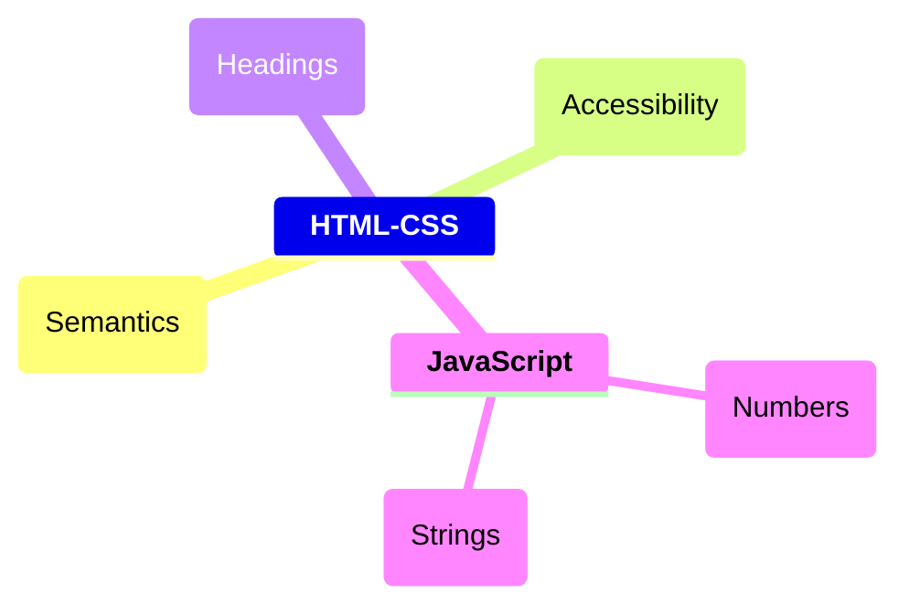

# Sintax

## Mind Maps Basics

```
mindmap
  **HTML-CSS**
    (Semantics)
    (Accessibility)
    (Headings)
    (Boilerplate)
    (Blank space and comments)
    (Paragraphs)
    (Lists)
    (HTML validity)
    (Landmarks)
    (Strong and em)
    (Images)
    (Intro CSS)
    (CSS Inheritance)
```
_Add 3 backsticks at the beginning and end of the code block with mermaid at the right side of the top backsticks to highlight the code_

```
mindmap
  **HTML-CSS**
    (Semantics)
    (Accessibility)
    (Headings)
  **JavaScript**
    (Numbers)
    (Strings)
```


_Use indentaion to create hierarchy between topics_

### Shapes

```
mindmap
	Formas
	    id[I am a square]
	    id(I am a rounded square)
	    id((I am a circle))
	    id))I am a bang((
	    id)I am a cloud(
	    id{{I am a hexagon}}
	    Default
```

_Resultado_


<br>

## EMR diagrams


## Flowchart


## Piechart

```mermaid


```
