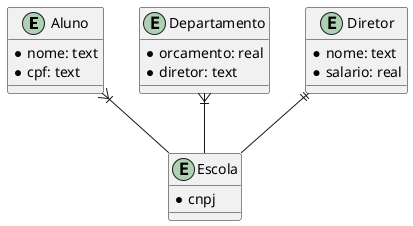
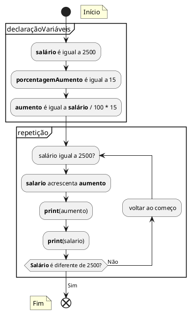
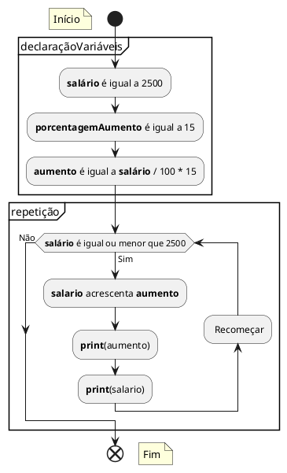
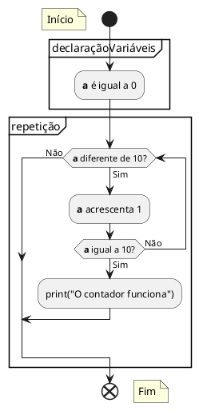
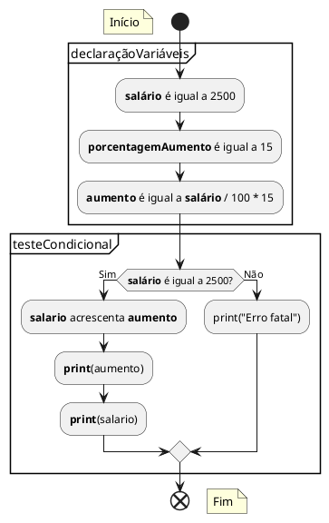
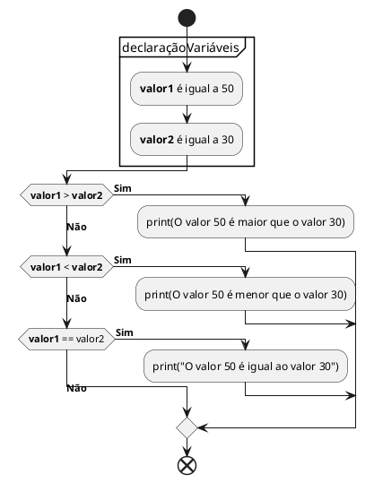

# PlantUML Sintax

## EMR

## Repeat Loop

## While Loop

### With backward function

### Without backward function

## Conditions

### If (floating notes included)

### Elseif (vertical mode on)

